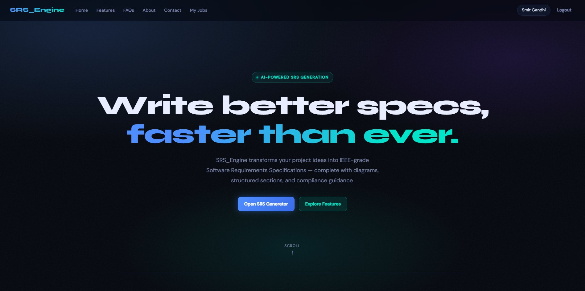
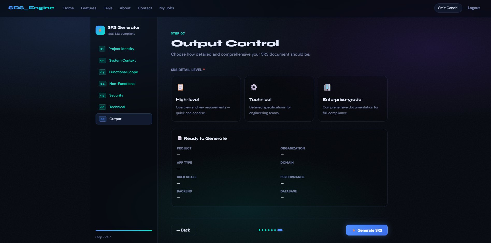
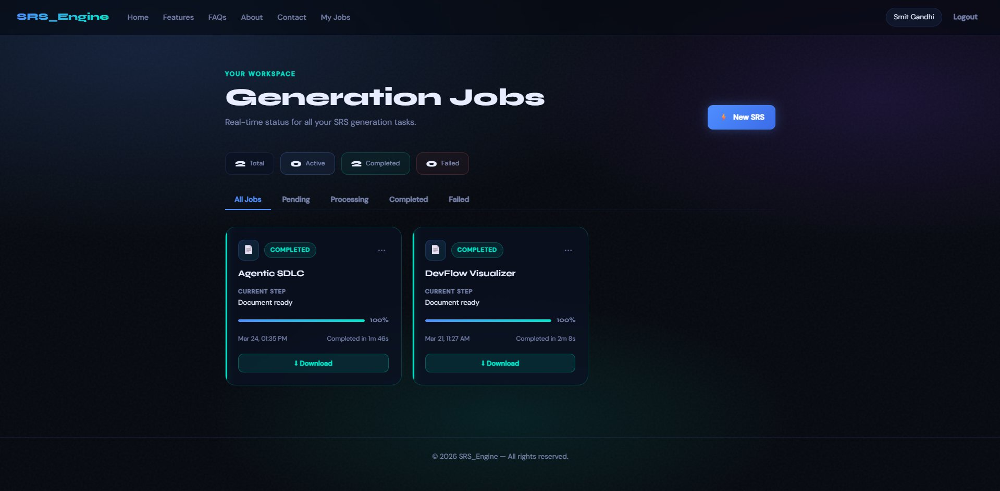
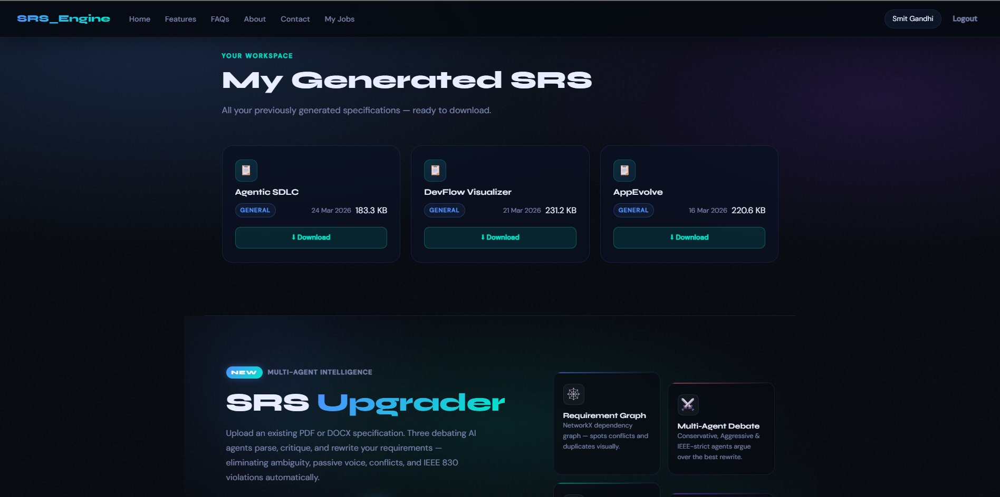
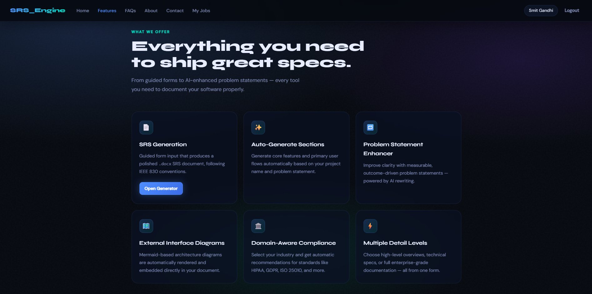
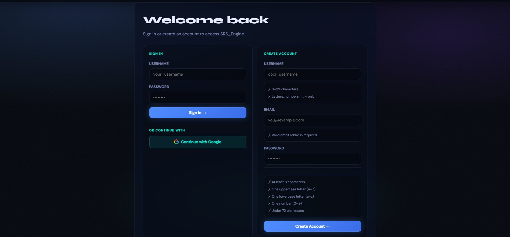
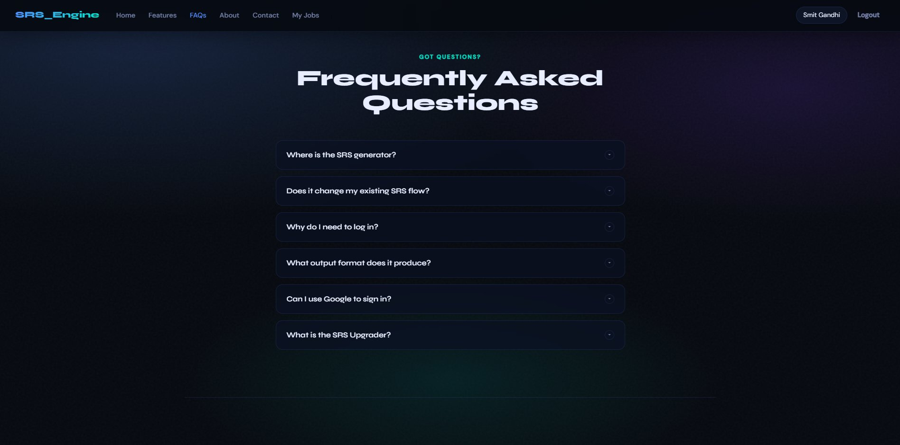
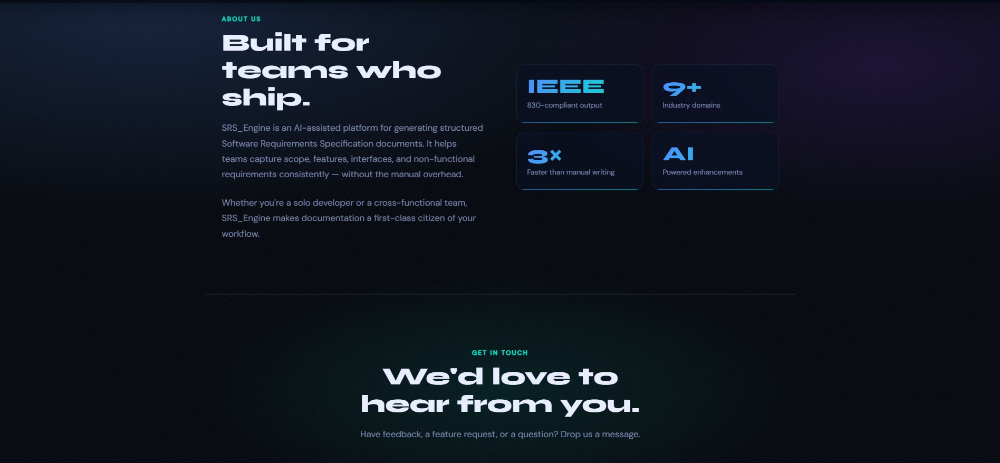
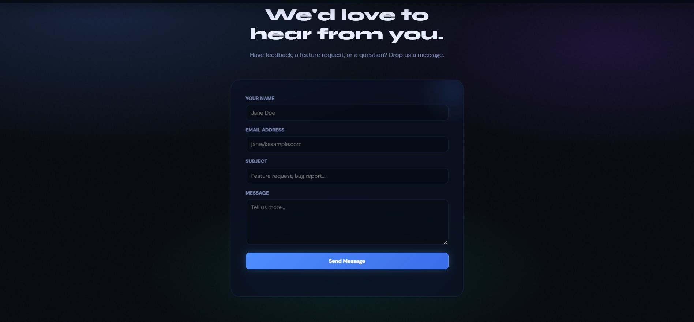

# SRS Engine

<div align="center">


**A production-grade, multi-agent AI system for generating and upgrading IEEE 830-compliant Software Requirements Specification documents — complete with architecture diagrams, async job processing, and email delivery.**

[Features](#-features) · [Architecture](#-architecture) · [Getting Started](#-getting-started) · [Configuration](#-configuration) · [Usage](#-usage) · [Deployment](#-deployment) · [API Reference](#-api-reference) · [Contributing](#-contributing)

</div>

---

## 📸 Screenshots

> Place your screenshots in a `screenshots/` folder at the repo root and name them as referenced below.

**Hero — Landing Page**


**SRS Generator — 7-Step Guided Form (Step 7: Output Control)**


**Job Tracker — Real-time generation status & download**


**My Generated SRS — Workspace & document history**


**Features Overview**


**Login — Username/Password + Google OAuth**


<details>
<summary>More screenshots (FAQs, About, Contact)</summary>

**FAQs**


**About & Stats**


**Contact Form**


</details>

---

## ✨ Features

### Currently Live
| Feature | Description |
|---|---|
| 🤖 **Multi-Agent SRS Generator** | A 7-step guided form (Project Identity → System Context → Functional Scope → NFRs → Security → Technical → Output Control) feeds 7 specialized AI agents that produce IEEE 830-1998 compliant documents at three detail levels: High-level, Technical, or Enterprise-grade |
| 📊 **Architecture Diagram Generation** | Automatically renders 4 Mermaid diagrams (User, Hardware, Software, Communication Interfaces) as PNGs embedded in the final `.docx` |
| 📋 **Job Tracker UI** | Real-time dashboard with per-job progress bars, status filters (All / Pending / Processing / Completed / Failed), completion time, and one-click `.docx` download |
| 🔐 **Auth — Username/Password + Google OAuth** | Register and sign in with a username/password account, or continue with Google. Sessions managed server-side with `SESSION_SECRET_KEY` |
| 📧 **Email Delivery** | Generated `.docx` is automatically emailed to the user upon job completion via SMTP |
| 🗄️ **Async Queue Architecture** | FastAPI publishes jobs to RabbitMQ; a separate worker process consumes and executes them — keeping the web server non-blocking under load |
| 🏠 **Workspace / Document History** | "My Generated SRS" page lists all previously generated documents with file size, date, and instant download — no re-generation needed |

### Domain-Specific Schema Support
The engine ships with Pydantic schemas for 9 industry verticals:

`Aerospace` · `Automotive` · `E-commerce` · `Education` · `Energy` · `Finance` · `Healthcare & Medical Devices` · `Telecom` · `General Technical SRS`

### Roadmap
- [ ] SRS Upgrader (section-by-section AI enhancement with question engine)
- [ ] Domain-specific SRS generation (PSAC, ASPICE, ISO 26262, DO-178C, etc.)
- [ ] Multi-worker horizontal scaling UI
- [ ] PDF export alongside `.docx`

---

## 🏗️ Architecture

```
┌─────────────┐     HTTP      ┌──────────────────┐    Publish    ┌───────────────┐
│   Browser   │ ──────────▶  │   FastAPI App     │ ───────────▶ │   RabbitMQ    │
│  (Jinja2)   │              │  (srs_engine/)    │              │  (Docker)     │
└─────────────┘              └──────────────────┘              └───────┬───────┘
                                      │                                 │ Consume
                                      │ Read/Write                      ▼
                                      ▼                        ┌───────────────┐
                              ┌──────────────┐                 │    Worker     │
                              │   MongoDB    │ ◀── Update ──── │  (worker.py)  │
                              │  (srs_jobs)  │                 └───────┬───────┘
                              └──────────────┘                         │
                                                                        │ Runs
                                                                        ▼
                                                           ┌────────────────────────┐
                                                           │   7 AI Agents (Groq)   │
                                                           │  ┌──────────────────┐  │
                                                           │  │ Phase 1 (parallel)│  │
                                                           │  │ · Introduction    │  │
                                                           │  │ · Overall Desc    │  │
                                                           │  │ · System Features │  │
                                                           │  │ · External Ifaces │  │
                                                           │  │ · NFR             │  │
                                                           │  └──────────────────┘  │
                                                           │  ┌──────────────────┐  │
                                                           │  │ Phase 2 (serial)  │  │
                                                           │  │ · Glossary        │  │
                                                           │  │ · Assumptions     │  │
                                                           │  └──────────────────┘  │
                                                           └────────────────────────┘
                                                                        │
                                                                        ▼
                                                           ┌────────────────────────┐
                                                           │  Document Generator    │
                                                           │  · 4 Mermaid diagrams  │
                                                           │  · .docx assembly      │
                                                           │  · Email delivery      │
                                                           └────────────────────────┘
```

### Generation Pipeline

| Phase | What runs | Duration |
|---|---|---|
| **Phase 1** | 5 agents run in parallel (Introduction → NFR) | ~1 min |
| **Rate limit wait** | Groq API cooldown | ~60 sec |
| **Phase 2** | Glossary + Assumptions agents | ~30 sec |
| **Diagrams** | 4 Mermaid PNG renders via `mmdc` | ~15 sec |
| **Packaging** | `.docx` build + email dispatch | ~10 sec |
| **Total** | End-to-end per document | **~3–4 min** |

---

## 📁 Project Structure

```
SRS_Engine/
├── srs_engine/
│   ├── agents/
│   │   ├── home_page_agents/
│   │   │   ├── auto_generate_agent/        # Generates SRS input from a raw problem statement
│   │   │   └── enhance_problem_statement_agent/
│   │   ├── technical_srs_agents/           # Core IEEE 830 section agents
│   │   │   ├── introduction_agent/
│   │   │   ├── overall_description_agent/
│   │   │   ├── system_features_agent/
│   │   │   ├── external_interfaces_agent/
│   │   │   ├── nfr_agent/
│   │   │   ├── glossary_agent/
│   │   │   └── assumptions_agent/
│   │   └── upgrader_agents/                # (Roadmap) SRS enhancement agents
│   │       ├── question_engine/
│   │       └── section_analyzer_agent/
│   ├── core/
│   │   ├── auth/                           # Google OAuth + session deps
│   │   ├── db/                             # MongoDB models, job repo, user repo
│   │   ├── logging/                        # Async structured logger
│   │   ├── queue/                          # RabbitMQ publisher + consumer
│   │   ├── routers/                        # FastAPI route handlers
│   │   └── services/                       # Business logic layer
│   ├── schemas/                            # Pydantic schemas (9 domain verticals)
│   ├── static/                             # JS, CSS, generated PNGs
│   ├── templates/                          # Jinja2 HTML templates
│   ├── utils/
│   │   ├── globals.py                      # Mermaid render helper + shared constants
│   │   ├── model.py                        # LLM client setup (Groq via LiteLLM)
│   │   └── srs_document_generator.py       # .docx assembly logic
│   ├── main.py                             # FastAPI app entrypoint
│   └── worker.py                           # RabbitMQ consumer / pipeline runner
├── logs/                                   # Structured daily log folders
├── .env.example
├── requirements.txt
└── README.md
```

---

## 🚀 Getting Started

### Prerequisites

| Requirement | Version | Notes |
|---|---|---|
| Python | 3.11+ | |
| Docker Desktop | Latest | Must be running |
| MongoDB | 7.0+ | Running locally on port `27017` |
| Node.js | LTS | Required for Mermaid CLI |
| Groq API Key | Free | [Get one here](https://console.groq.com/keys) |
| Google OAuth Credentials | — | [Google Cloud Console](https://console.cloud.google.com/) |

---

### Step 1 — Clone the Repository

```bash
git clone https://github.com/smitngandhi/SRS_Engine.git
cd SRS_Engine
```

---

### Step 2 — Create a Virtual Environment

**Windows:**
```bash
python -m venv venv
venv\Scripts\activate
```

**macOS / Linux:**
```bash
python3 -m venv venv
source venv/bin/activate
```

---

### Step 3 — Install Dependencies

```bash
pip install --upgrade pip
pip install -r requirements.txt
pip install aio-pika
```

---

### Step 4 — Install Mermaid CLI

```bash
npm install -g @mermaid-js/mermaid-cli
mmdc --version   # Verify installation
```

> **⚠️ Windows users:** After installation you must hard-code the `mmdc` path in `srs_engine/utils/globals.py`.
> Find the `render_mermaid_png` function and update the `subprocess.run` call:
>
> ```python
> subprocess.run([
>     r"C:\Users\<YourUsername>\AppData\Roaming\npm\mmdc.cmd",
>     "-i", str(mmd_path),
>     "-o", str(output_path)
> ], check=True)
> ```
> Replace `<YourUsername>` with your actual Windows username. Without this, diagram generation will silently fail.

---

## ⚙️ Configuration

Copy `.env.example` to `.env` and fill in your values:

```bash
cp .env.example .env
```

### Full `.env` Reference

```env
# ── LLM ──────────────────────────────────────────────────
GROQ_API_KEY=your_groq_api_key_here

# Available models:
# groq/meta-llama/llama-4-scout-17b-16e-instruct   ← Recommended
# groq/meta-llama/llama-3.3-70b-versatile          ← Highest quality
# groq/meta-llama/llama-3.1-8b-instant             ← Fastest
GROQ_MODEL=groq/meta-llama/llama-4-scout-17b-16e-instruct

# ── Auth ─────────────────────────────────────────────────
SESSION_SECRET_KEY=any_long_random_string_min_32_chars

GOOGLE_CLIENT_ID=your_google_client_id
GOOGLE_CLIENT_SECRET=your_google_client_secret
GOOGLE_REDIRECT_URI=http://localhost:8000/auth/callback

# ── Database ─────────────────────────────────────────────
MONGODB_URI=mongodb://localhost:27017
MONGODB_DB=srs_engine

# ── Queue ────────────────────────────────────────────────
RABBITMQ_HOST=localhost
RABBITMQ_PORT=5672
RABBITMQ_USER=guest
RABBITMQ_PASSWORD=guest
RABBITMQ_VHOST=/
RABBITMQ_SRS_QUEUE=srs_generation

# ── Email ────────────────────────────────────────────────
SMTP_HOST=smtp.gmail.com
SMTP_PORT=587
SMTP_USERNAME=your_email@gmail.com
SMTP_PASSWORD=your_app_password
SMTP_FROM_EMAIL=your_email@gmail.com
SMTP_TO_EMAIL=recipient@example.com
```

> **Gmail tip:** Use an [App Password](https://myaccount.google.com/apppasswords) rather than your main account password when `SMTP_HOST=smtp.gmail.com`.

### Setting up Google OAuth

1. Go to [Google Cloud Console](https://console.cloud.google.com/) → **APIs & Services → Credentials**
2. Create an **OAuth 2.0 Client ID** (Web application)
3. Add Authorized Redirect URIs:
   - Local: `http://localhost:8000/auth/callback`
   - Production: `https://yourdomain.com/auth/callback`
4. Copy **Client ID** and **Client Secret** into your `.env`

---

## ▶️ Usage

Start the application with **three terminals, in order**.

### Terminal 1 — RabbitMQ (via Docker)

```bash
docker run -it --rm --name rabbitmq \
  -p 5672:5672 -p 15672:15672 \
  rabbitmq:4-management
```

Wait until you see:
```
Server startup complete
```

> RabbitMQ Management UI: **http://localhost:15672** — Login: `guest` / `guest`

---

### Terminal 2 — FastAPI Application

```bash
cd SRS_Engine
uvicorn srs_engine.main:app --reload --port 8000
```

Wait until you see:
```
Startup | Initializing MongoDB connection
Startup | Connecting to RabbitMQ
RabbitMQ | Queue declared | queue=srs_generation
Startup | RabbitMQ ready
```

> App available at: **http://localhost:8000**

---

### Terminal 3 — Worker Process

```bash
cd SRS_Engine
python -m srs_engine.worker
```

You should see:
```
Worker | Starting up | queue=srs_generation
Consumer | Connecting | host=localhost port=5672 queue=srs_generation
Consumer | Waiting for jobs | queue=srs_generation
```

The worker is now idle and will activate the moment a user submits the form.

---

### Generating an SRS Document

1. Open **http://localhost:8000** in your browser
2. Sign in with Google
3. Fill in the SRS form:
   - Project Name
   - Problem Statement / Description
   - Key Features
   - Target Users
   - Technology Stack (optional)
4. Click **Generate SRS**
5. You'll be redirected to the **Job Tracker** at `/jobs`
6. Watch the progress bar advance through the pipeline phases
7. When complete, a **Download** button appears and the `.docx` is emailed to you

### Job Progress Reference

| Progress | Phase |
|---|---|
| 0% | Job queued in RabbitMQ |
| 20% | Phase 1 agents running (parallel) |
| ~35% | API rate-limit wait (~60s) |
| 55–60% | Phase 2 agents (Glossary, Assumptions) |
| 75% | Mermaid diagrams rendered |
| 90% | `.docx` assembled |
| 100% | Email sent, download available |

### Output Files

```
srs_engine/generated_srs/
└── {ProjectName}_SRS.docx

srs_engine/static/
├── {ProjectName}_user_interfaces_diagram.png
├── {ProjectName}_hardware_interfaces_diagram.png
├── {ProjectName}_software_interfaces_diagram.png
└── {ProjectName}_communication_interfaces_diagram.png
```

---

## 📈 Scaling

To handle multiple concurrent users, open additional terminals and run extra worker instances. RabbitMQ distributes jobs one-at-a-time across all running workers automatically.

```bash
# Terminal 3
python -m srs_engine.worker

# Terminal 4
python -m srs_engine.worker

# Terminal 5 (and so on...)
python -m srs_engine.worker
```

Each worker processes one job at a time; the queue handles buffering.

---

## 🌐 Deployment

### Environment Differences

| Setting | Local | Production |
|---|---|---|
| `GOOGLE_REDIRECT_URI` | `http://localhost:8000/auth/callback` | `https://yourdomain.com/auth/callback` |
| `MONGODB_URI` | `mongodb://localhost:27017` | MongoDB Atlas URI or self-hosted |
| `RABBITMQ_HOST` | `localhost` | CloudAMQP URL or self-hosted host |
| `uvicorn` workers | 1 (dev reload) | Multiple via Gunicorn |

### Production Startup (Gunicorn + Uvicorn workers)

```bash
gunicorn srs_engine.main:app \
  -k uvicorn.workers.UvicornWorker \
  -w 4 \
  --bind 0.0.0.0:8000
```

Run your worker processes as background services (e.g. via `systemd` or `supervisord`):

```bash
# systemd unit example
[Unit]
Description=SRS Engine Worker
After=network.target

[Service]
WorkingDirectory=/app/SRS_Engine
ExecStart=/app/venv/bin/python -m srs_engine.worker
Restart=always
EnvironmentFile=/app/SRS_Engine/.env

[Install]
WantedBy=multi-user.target
```

### MongoDB Atlas (Production DB)

Replace your `MONGODB_URI` with your Atlas connection string:

```env
MONGODB_URI=mongodb+srv://<user>:<password>@cluster0.xxxxx.mongodb.net/?retryWrites=true&w=majority
```

### CloudAMQP (Production Queue)

```env
RABBITMQ_HOST=your-instance.cloudamqp.com
RABBITMQ_USER=your_user
RABBITMQ_PASSWORD=your_password
RABBITMQ_VHOST=your_vhost
```

---

## 📡 API Reference

Interactive docs auto-generated by FastAPI — available when the server is running:

- **Swagger UI:** `http://localhost:8000/docs`
- **ReDoc:** `http://localhost:8000/redoc`

> 🔒 = requires login session &nbsp;|&nbsp; 📡 = Server-Sent Events stream

---

### Pages

| Method | Path | Auth | Description |
|---|---|---|---|
| `GET` | `/` | — | Redirects to `/home` |
| `GET` | `/home` | — | Landing page (hero, features, FAQs, about, contact) |
| `GET` | `/login` | — | Login / register page |
| `GET` | `/srs-generator` | — | 7-step SRS generation form |
| `GET` | `/jobs` | 🔒 | Job Tracker — real-time generation dashboard |
| `GET` | `/srs-upgrader` | — | SRS Upgrader upload step |
| `GET` | `/srs-upgrader/review/{file_id}` | 🔒 | Upgrader analysis & diff review |

---

### Auth

| Method | Path | Auth | Description |
|---|---|---|---|
| `POST` | `/auth/login` | — | Sign in with username + password |
| `POST` | `/auth/register` | — | Create a new username/password account |
| `GET` | `/auth/logout` | — | Clear session and redirect to `/login` |
| `GET` | `/auth/google/login` | — | Initiate Google OAuth flow |
| `GET` | `/auth/google/callback` | — | Google OAuth redirect handler |

---

### SRS Generation

| Method | Path | Auth | Description |
|---|---|---|---|
| `POST` | `/generate_srs` | 🔒 | Submit an SRS generation job — returns `job_id` immediately; actual generation runs in the background worker |
| `POST` | `/enhance-problem-statement` | 🔒 | AI-rewrite a raw problem statement into a measurable, outcome-driven version |
| `POST` | `/auto-generate-section` | 🔒 | Auto-generate core features and primary user flows from a project name and description |
| `GET` | `/my-jobs` | 🔒 | List up to 50 most recent jobs for the logged-in user |
| `GET` | `/job/{job_id}/status` | 🔒 | One-shot JSON status check for a job (polling fallback) |
| `GET` | `/job/{job_id}/status/stream` | 🔒 📡 | SSE stream — pushes live progress updates until job reaches `completed` or `failed` |

**SSE event shape (`/job/{job_id}/status/stream`):**
```json
{
  "job_id": "abc123",
  "status": "processing",
  "progress": 55,
  "current_step": "Running glossary agent",
  "project_name": "My Project",
  "result_path": null,
  "error": null,
  "created_at": "2026-03-29T10:00:00Z",
  "updated_at": "2026-03-29T10:02:00Z",
  "completed_at": null
}
```

---

### Documents

| Method | Path | Auth | Description |
|---|---|---|---|
| `GET` | `/api/my-documents` | 🔒 | List all previously generated `.docx` files for the logged-in user |
| `GET` | `/api/download-srs/{doc_id}` | 🔒 | Download a specific generated `.docx` by document ID |

---

### Contact

| Method | Path | Auth | Description |
|---|---|---|---|
| `POST` | `/api/contact` | — | Submit the contact form — sends an email via SMTP |

---

### Upload (SRS Upgrader)

| Method | Path | Auth | Description |
|---|---|---|---|
| `POST` | `/upload/srs` | 🔒 | Upload a PDF or DOCX SRS document |
| `GET` | `/upload/srs/list` | 🔒 | List all uploaded files for the current user |
| `DELETE` | `/upload/srs/{file_id}` | 🔒 | Delete a specific uploaded file |

---

### Parse (SRS Upgrader)

| Method | Path | Auth | Description |
|---|---|---|---|
| `POST` | `/parse/srs/{file_id}` | 🔒 | Trigger parsing of an uploaded SRS file into structured JSON |
| `GET` | `/parse/srs/{file_id}` | 🔒 | Fetch the full `UnifiedDocumentJSON` for a parsed file |
| `GET` | `/parse/srs/{file_id}/preview` | 🔒 | Lightweight preview — returns metadata and top-level section titles only |

---

### Upgrade (SRS Upgrader)

| Method | Path | Auth | Description |
|---|---|---|---|
| `POST` | `/upgrade/srs/{file_id}/session` | 🔒 | Create an upgrade session — snapshots all sections. Idempotent. |
| `GET` | `/upgrade/srs/{file_id}/progress` | 🔒 📡 | SSE stream of section-level analysis progress events |
| `POST` | `/upgrade/srs/{file_id}/analyse` | 🔒 | Run the section analyser agent on all sections concurrently |
| `POST` | `/upgrade/srs/{file_id}/questions` | 🔒 | Generate clarifying questions for all flagged sections |
| `POST` | `/upgrade/srs/{file_id}/answers` | 🔒 | Submit user answers for flagged sections |
| `PATCH` | `/upgrade/srs/{file_id}/section/{section_id}` | 🔒 | Accept, reject, or edit upgraded content for a section |
| `GET` | `/upgrade/srs/{file_id}/session` | 🔒 | Get the full current upgrade session state |
| `GET` | `/upgrade/srs/{file_id}/export` | 🔒 | Assemble and return the final upgraded document |

**Upgrade pipeline flow:**
```
Upload → Parse → Create Session → Analyse → Questions → Answers → Review (Accept/Reject/Edit) → Export
```

---

## 🔍 Monitoring

| Tool | URL | What to watch |
|---|---|---|
| **Job Tracker UI** | http://localhost:8000/jobs | Live progress for all jobs |
| **RabbitMQ Management** | http://localhost:15672 | Queue depth, message rates, consumer status |
| **MongoDB Compass** | localhost:27017 | `srs_engine` → `srs_jobs` collection |
| **FastAPI logs** | Terminal 2 | HTTP requests, publish confirmations |
| **Worker logs** | Terminal 3 | Pipeline phases, agent completions, errors |
| **Daily log files** | `logs/YYYY-MM-DD/` | Structured async logs per run |

---

## 🛑 Stopping the Application

```bash
# Terminal 3 — Stop worker
Ctrl + C

# Terminal 2 — Stop FastAPI
Ctrl + C

# Terminal 1 — Stop RabbitMQ (auto-removes container due to --rm)
Ctrl + C
```

### Resetting Stuck Jobs

Any job that was `processing` when the worker was killed will remain stuck. Reset them in MongoDB Compass or `mongosh`:

```js
db.srs_jobs.updateMany(
  { status: "processing" },
  { $set: { status: "failed", error: "Worker restarted", completed_at: new Date() } }
)
```

---

## 🐛 Troubleshooting

| Symptom | Cause | Fix |
|---|---|---|
| `RabbitMQ connection failed` on startup | Docker container not running | Start Terminal 1 first, wait for `Server startup complete` |
| `Consumer \| Waiting for jobs` never appears | Worker can't reach RabbitMQ | Check `RABBITMQ_HOST` in `.env` |
| Job stuck at 20% indefinitely | Groq API rate limit or error | Check Terminal 3 logs; wait and retry |
| `mmdc: command not found` | Mermaid CLI not installed or not on PATH | `npm install -g @mermaid-js/mermaid-cli`; Windows users must hard-code path in `globals.py` |
| Diagrams not generating (Windows) | `mmdc` path not configured | See [Step 4](#step-4--install-mermaid-cli) above |
| `FileNotFoundError` in email logs | `.docx` failed to generate | Check Terminal 3 for earlier generation errors in the same job |
| `SMTP settings are not configured` | Missing env vars | Fill in all five `SMTP_*` values in `.env` |
| `ModuleNotFoundError` on startup | venv not activated | Run `venv\Scripts\activate` (Windows) or `source venv/bin/activate` (Mac/Linux) |
| OAuth redirect mismatch | `GOOGLE_REDIRECT_URI` mismatch | Ensure `.env` URI exactly matches what's registered in Google Cloud Console |
| Port 8000 in use | Another process running | `uvicorn srs_engine.main:app --reload --port 8001` |

---

## 🤝 Contributing

Contributions are welcome!

1. Fork the repository
2. Create a feature branch: `git checkout -b feature/your-feature-name`
3. Make your changes with clear, descriptive commits
4. Push to your fork: `git push origin feature/your-feature-name`
5. Open a Pull Request against `main`

Please ensure:
- New agents follow the existing `agent.py` + `prompt.py` + `__init__.py` structure
- New schemas extend the appropriate Pydantic base
- Any new `.env` keys are documented in `.env.example`

---

## 📄 License

This project is licensed under the **MIT License**. See [LICENSE](LICENSE) for details.

---

## 🙏 Acknowledgments

Built with:

[FastAPI](https://fastapi.tiangolo.com/) · [Groq](https://groq.com/) · [LiteLLM](https://docs.litellm.ai/) · [Mermaid](https://mermaid.js.org/) · [python-docx](https://python-docx.readthedocs.io/) · [RabbitMQ](https://www.rabbitmq.com/) · [MongoDB](https://www.mongodb.com/) · [aio-pika](https://aio-pika.readthedocs.io/)

---

<div align="center">

**Made with ❤️ by [Smit Gandhi](https://github.com/smitngandhi)**

⭐ Star this repo if you find it helpful!

[🐛 Report Bug](https://github.com/smitngandhi/SRS_Engine/issues) · [💡 Request Feature](https://github.com/smitngandhi/SRS_Engine/issues)

</div>